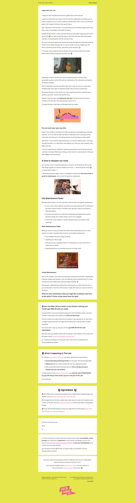
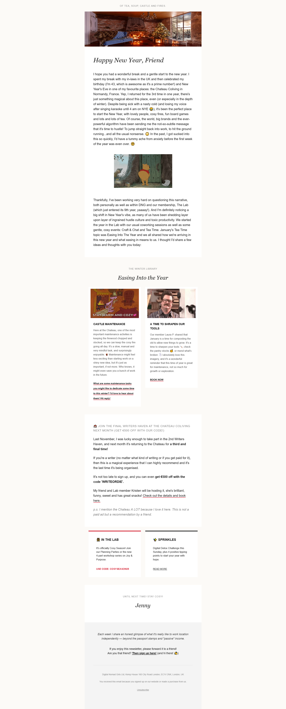
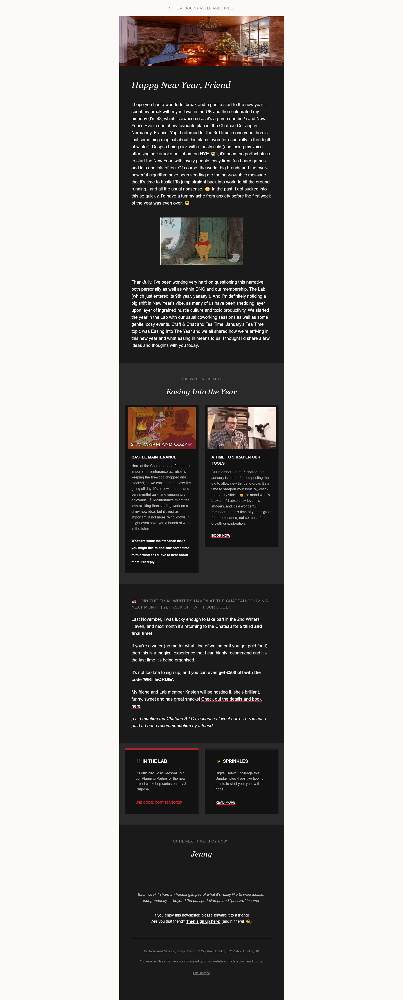

# Project 2: Luxury Editorial Newsletter Redesign

## 📌 Project Overview
A complete redesign of a text-heavy editorial newsletter into a premium "Luxury Digest" format. This project demonstrates advanced MJML layout techniques and high-visibility Dark Mode architecture.

---

## 📸 Design Comparison

### The Transformation (Before vs. After)
<table>
  <tr>
    <td align="center"><b>Original Email (Before)</b></td>
    <td align="center"><b>Redesign (After)</b></td>
  </tr>
  <tr>
    <td></td>
    <td></td>
  </tr>
</table>

### 🌗 Dark Mode Implementation
One of the key technical features of this redesign is the custom-coded Dark Mode, ensuring high legibility and brand consistency across all system themes.

  

---

## 🛠 Technical Features
* **Custom Dark Mode Architecture:** Implemented `prefers-color-scheme` logic with specialized CSS overrides for cards and links.
* **Editorial Typography:** Used a mix of Georgia (Serif) and Arial (Sans-Serif) to create a high-end lookbook aesthetic.
* **Modern UI Components:** Developed "Editorial Cards" with hover-effect borders and modern link styling.

## 🚀 Key Learning
Managing color contrast in Dark Mode required targeting specific MJML-generated table structures to ensure that links and preheaders remained visible without losing their subtle branding.
